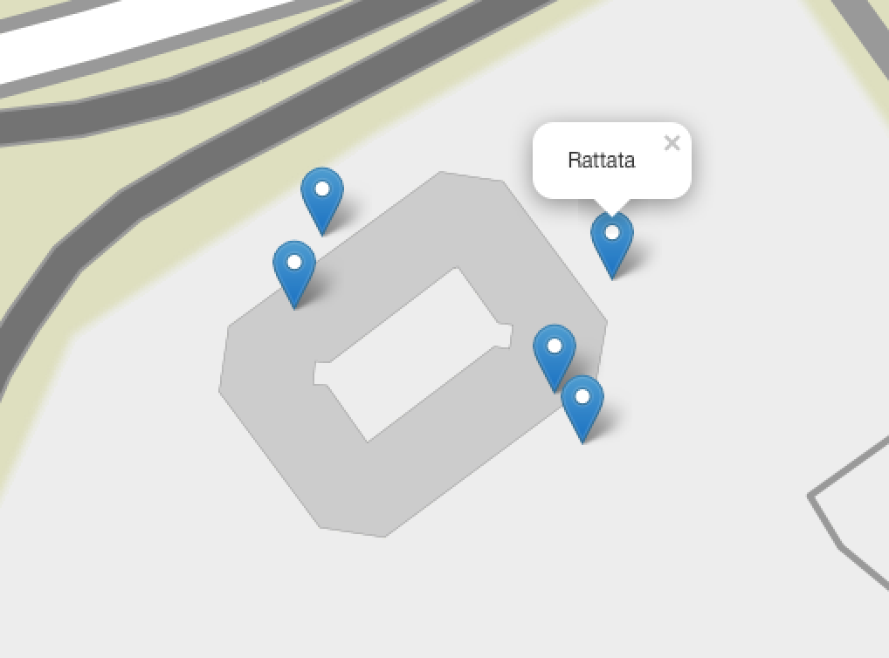

# Pokemon Go API Demo with OpenStreetMap Folium Leaflet

 * USE AT YOUR OWN RISK !
 * includes protobuf file
 * ugly code
 * andylicious code enhancement 

This code is a fork from https://github.com/tejado/pgoapi, and all I've done here is utilize the folium library to add markers to the location of each pokemon. It saves the map to an .html file and immediately runs a web browser to that file for easy viewing. 

You need a pokemon trainer account, located here: https://sso.pokemon.com/sso/login?locale=en&service=https://www.pokemon.com/us/pokemon-trainer-club/caslogin

Suggested to use dummy test dev account for this.

Sign up should be fairly simple, and you utilize the user/pass as CLI arguments
## Pre-installation
	sudo su 
	pip install protobuf geopy requests s2sphere folium

## Demo

    $ python main.py -u username -p mypassword -l "204 2nd Ave, San Mateo"
	[!] Your given location: 204 2nd Ave, San Mateo, CA 94403, USA
	[!] lat/long/alt: 37.5513481 -122.291137 0.0
    [!] login for: tejado
    [+] RPC Session Token: TGT-899360-gFKDueEjBcKX4G ...
    [+] Received API endpoint: https://pgorelease.nianticlabs.com/plfe/401/rpc
    [+] Login successful
    [+] Username: username 
    [+] You are playing Pokemon Go since: 2016-07-13 08:10:20
    [+] Poke Storage: 250
    [+] Item Storage: 350
    [+] POKECOIN: 0
    [+] STARDUST: 600
	Within one step of LatLng: 37.7861784887,-122.408499387 (222m SW from you):
    	(92) Gastly
	Within one step of LatLng: 37.7885606156,-122.408499387 (112m NW from you):
    	(21) Spearow
    	(41) Zubat
    	(32) Nidoran ♂

	(21) Spearow is visible at (37.7886329623, -122.407658647) for 169 seconds (73m NW from you)
	(41) Zubat is visible at (37.7887988683, -122.409782609) for 70 seconds (224m NW from you)
	(32) Nidoran ♂ is visible at (37.7885226453, -122.408986128) for 805 seconds (148m NW from you)
	(41) Zubat is visible at (37.7890195112, -122.40712765) for 84 seconds (117m NE from you)
	(23) Ekans is visible at (37.7900544956, -122.407393149) for 227 seconds (229m N from you)
	(92) Gastly is visible at (37.7869393568, -122.408809132) for 356 seconds (168m SW from you)

Pressing "y" will continually add markers for each pokemon found. 
Pressing "n" will output the map in a new browser. Tested only on a mac so far

## Credits
Thanks a lot to [Mila432](https://github.com/Mila432/Pokemon_Go_API) !  
[C# Port](https://github.com/BclEx/pokemongo-api-demo.net) by BclEx
Addendum: Thanks to leegao for the concept and proof of code/example! 
